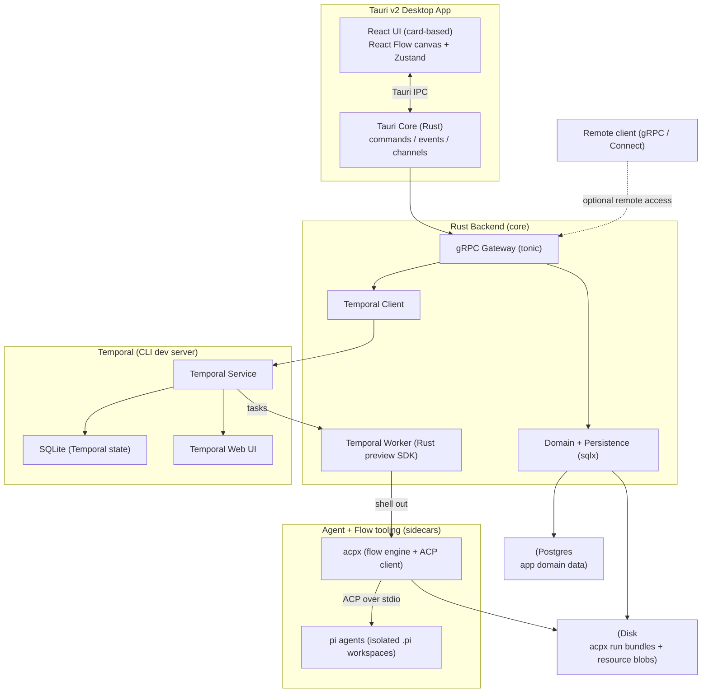
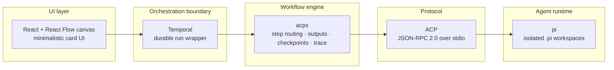
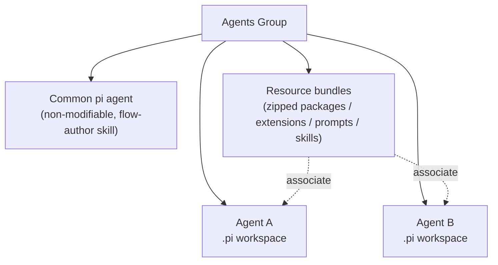
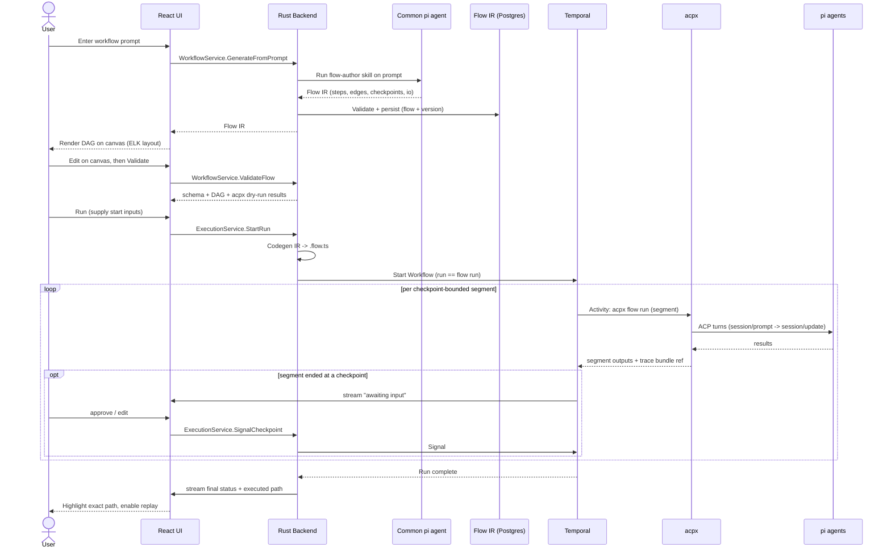
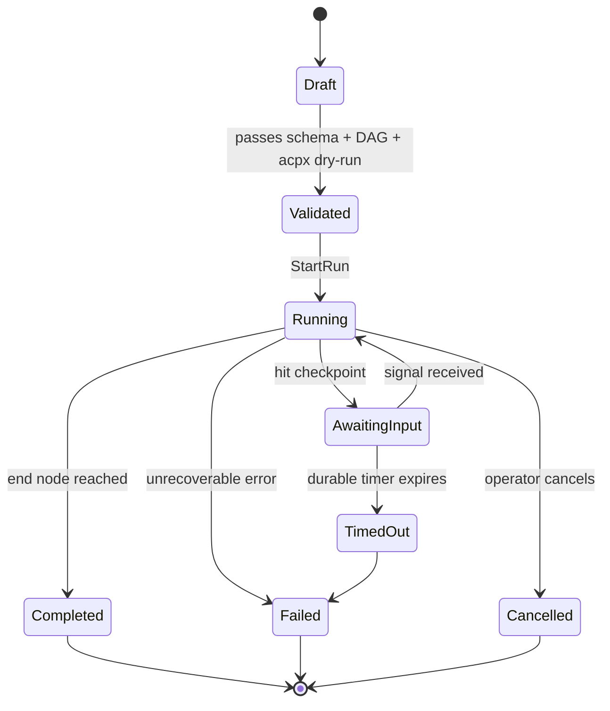
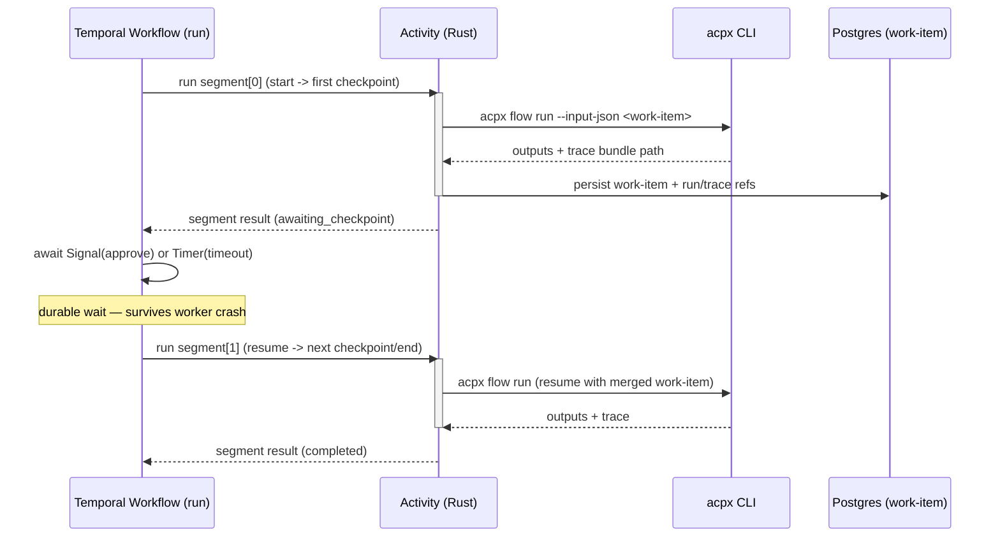
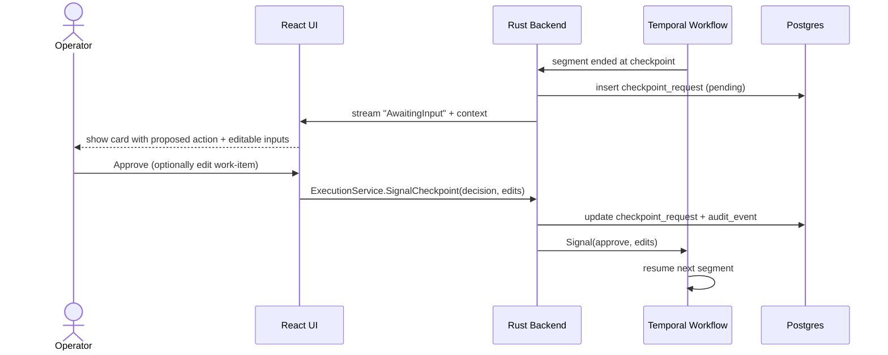
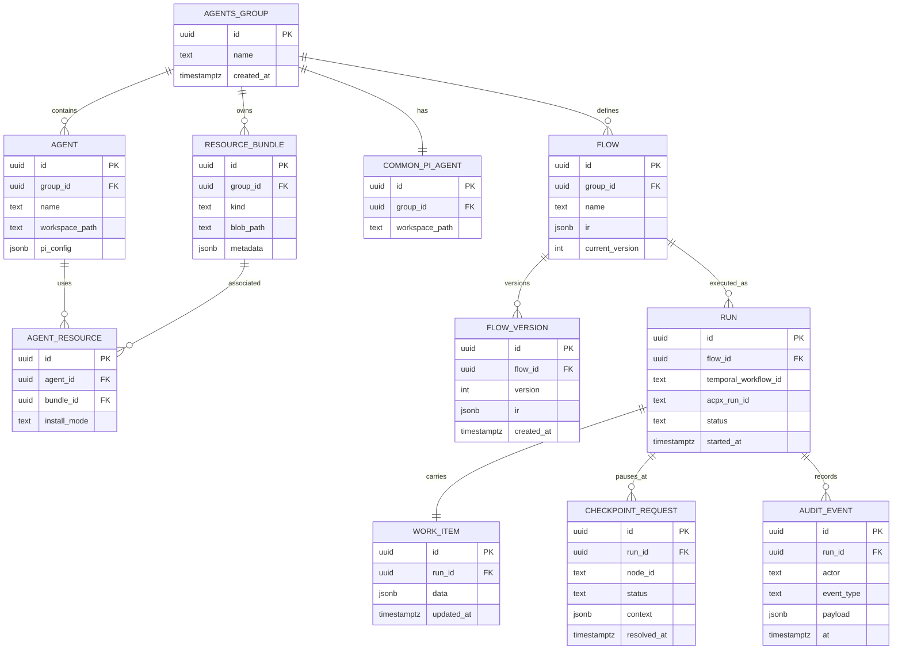
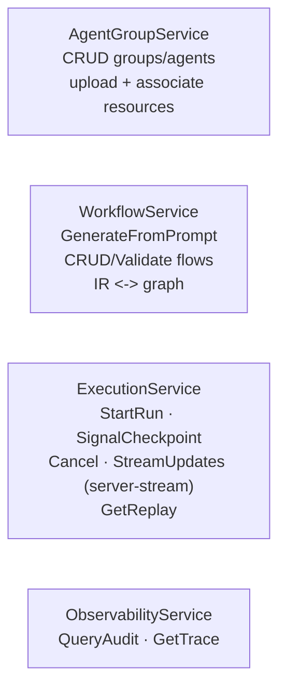
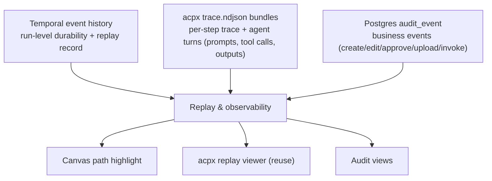

# Agentic Workflow Platform — Design Document (North Star)

> Status: **Design / north-star** · Iteration: **docs only** (no code yet)
> Scope of build: deferred to later iterations following the roadmap at the end of this document.

A cross-platform **desktop application** for defining **groups of isolated AI coding agents**, turning a
**natural-language prompt into a multi-step workflow**, **editing that workflow on a WYSIWYG canvas**, and
**running it durably** with **human checkpoints, full audit, replay, and observability**.

This document is the single source of truth for the system's intent and shape. Every later iteration
should trace back to it.

---

## 1. Vision & objectives

The platform lets a user:

1. **Organize agents into groups.** A *group* is a workspace; each *agent* in it is an isolated
   [`pi`](https://github.com/earendil-works/pi/tree/main/packages/coding-agent) coding agent with its own
   coding directory, dynamically created/updated.
2. **Equip agents with capabilities.** Upload zipped **packages / extensions / prompts / skills** to a
   group and associate them with individual agents.
3. **Author workflows from a prompt.** A default, non-modifiable **"common pi agent"** per group reads the
   user's instruction and decomposes it into discrete **steps / substeps**, with **inputs/outputs,
   conditions, forks/joins, and human input/validation steps**, authored to
   [**acpx**](https://github.com/openclaw/acpx) flow conventions and driven over the
   [**Agent Client Protocol (ACP)**](https://agentclientprotocol.com/get-started/introduction).
4. **Visualize and edit.** The generated flow is shown on a canvas at creation time, then editable in a
   **WYSIWYG editor** whose output is **validatable and verifiable**.
5. **Run durably and observe.** Runs are wrapped by [**Temporal**](https://temporal.io) for durability; the
   canvas **highlights the exact path** taken from start to end, depending on the input. A per-run
   **work-item JSON** carries data and processing across steps.
6. **Trust the system.** **Audit trail, replayability, and observability** are first-class — especially for
   agents.

### Non-functional north stars

- **Modern, minimalistic, card-based UI** — not verbose or heavy.
- **Isolated projects within one repo** (modular monorepo) rather than one giant project.
- **gRPC** for all remotely-accessible services.
- Operational hygiene: **cleanup scripts, DB reset, ER diagrams**.

---

## 2. Glossary

| Term | Meaning |
|---|---|
| **ACP** | Agent Client Protocol — JSON-RPC 2.0 over stdio between a *client* (orchestrator) and an *agent* (subprocess). |
| **pi** | The coding-agent runtime (Node/TS). One isolated `.pi` workspace per agent. Does **not** natively speak ACP. |
| **acpx** | Headless ACP **client + flow engine** (Node/TS). Ships a built-in `pi` adapter (the ACP bridge to pi). Runs `.flow.ts` flows. |
| **Flow IR** | Our canonical JSON intermediate representation of a workflow. Source of truth for canvas, validation, and acpx codegen. |
| **Common pi agent** | A default, non-modifiable pi agent per group, configured with a `flow-author` skill, that turns a prompt into a Flow IR. |
| **Temporal** | Durable-execution engine. A Workflow == a flow *run*; acpx executions are Activities. |
| **Work-item** | A per-run JSON payload representing data + processing at each step. Persisted in Postgres; mirrored into acpx `outputs`. |
| **Agents Group** | A workspace grouping agents + shared resource bundles + a common pi agent. |
| **Checkpoint** | A human input/validation gate (acpx `checkpoint` node). |

---

## 3. Personas & key journeys

- **Builder** — defines a group, adds agents, uploads skills/extensions, authors a workflow from a prompt,
  tweaks it on the canvas.
- **Operator** — runs a workflow, supplies start inputs, approves/edits at checkpoints, watches live
  progress.
- **Auditor** — reviews who did what, replays a past run step-by-step, inspects each agent turn.

**Primary journey (happy path)**

1. Create group → add 2–3 agents → upload a `skills.zip`, associate it with an agent.
2. Type a prompt: *"Triage incoming bug reports, reproduce, propose a fix, and open a PR after my
   approval."*
3. Common pi agent emits a Flow IR → canvas renders it → builder adjusts a branch → validates.
4. Operator runs it, fills the start inputs, approves at the "open PR" checkpoint.
5. Canvas highlights the exact path taken; auditor later replays the run and inspects every agent turn.

---

## 4. System architecture



**Reading the diagram:** the desktop UI talks to its Rust core over Tauri IPC for low-latency in-app calls;
the same backend exposes **gRPC** so remote clients can drive it. Durable runs go through the Temporal
client → service → a **Rust worker** whose activities **shell out** to `acpx`, which in turn drives `pi`
agents over ACP. App domain data lives in **Postgres**; Temporal keeps its own state in **SQLite**; acpx
run bundles and uploaded resource blobs live on **disk**.

---

## 5. Layered responsibility model



**Who owns what (the critical boundary):**

| Concern | Owner | Notes |
|---|---|---|
| Agent reasoning, tool calls, code edits | **pi** | One isolated `.pi` workspace per agent. |
| ACP wire protocol | **ACP** | acpx's built-in `pi` adapter bridges pi ↔ ACP. |
| Step routing, `outputs`/work-item flow, **human checkpoints**, intra-flow trace | **acpx** | acpx is the *workflow engine*. |
| **Durability**, retries on transient failure, scheduling, cancellation, run record | **Temporal** | Temporal *wraps* acpx runs (coarse). |
| Domain data, audit, gRPC, IPC | **Rust backend** | Postgres + tonic + Tauri core. |
| Visualization, editing, live path highlight | **React UI** | React Flow + ELK. |

> **Design honesty:** because Temporal *wraps* acpx runs rather than orchestrating each node, fine-grained
> per-step durability and per-step Temporal signals are **not** automatic. We recover human-in-the-loop
> durability by **segmenting a run at checkpoints** (see §8). Per-step observability comes from acpx's
> `trace.ndjson`, not Temporal history.

---

## 6. Agents Group & Agent model



**Agent isolation (grounded in pi's model).** Each agent is pinned to its own working directory and a
project-local `.pi/` that layers over the global `~/.pi/agent/`:

```
<group>/<agent-id>/
  .pi/
    settings.json      # model, tools, thinking level (overrides global)
    extensions/        # *.ts extensions
    skills/            # SKILL.md packages
    prompts/           # *.md prompt templates
    AGENTS.md          # agent instructions
  <agent working tree>
```

**Resource bundles → association.** A user uploads a zip to the group. On association with an agent we
either `pi install <spec>` (for npm/git/local package specs) or extract into that agent's
`.pi/extensions|skills|prompts/`, then trigger a reload. Bundle metadata is stored in Postgres; the blob
lives on disk.

**Common pi agent.** Created by default per group, **non-modifiable**, configured with a bundled
`flow-author` skill that encodes acpx authoring guidelines. Its sole job: prompt → **Flow IR**.

---

## 7. Flow lifecycle: prompt → IR → canvas → run → replay



**Run-state machine**



---

## 8. Flow IR specification

The **Flow IR** is canonical JSON. It maps bidirectionally to (a) the **acpx `.flow.ts`** (for execution +
replay-viewer compatibility) and (b) the **React Flow graph** (for editing).

Node types mirror acpx primitives:

| IR node `type` | acpx primitive | Purpose |
|---|---|---|
| `acp` | `acp` | One model-shaped ACP turn against a pi agent session. |
| `action` | `action` | Deterministic shell/HTTP step. |
| `compute` | `compute` | Pure local data transform / routing. |
| `decision` | `decision` + `decisionEdge` | Constrained-choice branch (typed routing). |
| `checkpoint` | `checkpoint` | Human input/validation gate. |

Annotated example:

```jsonc
{
  "id": "bug-triage",
  "name": "Bug triage and fix",
  "version": 3,
  "startAt": "load_report",
  "endAt": ["landed", "closed"],
  "input": {                          // collected from the operator at run start
    "report_url": { "type": "string", "required": true }
  },
  "workItemSchema": {                 // shape of the per-run work-item JSON
    "report": "object",
    "diagnosis": "object",
    "patch": "string"
  },
  "permissions": { "requiredMode": "approve-reads" },
  "nodes": {
    "load_report":  { "type": "compute",  "agent": null,   "out": ["report"] },
    "reproduce":    { "type": "acp",      "agent": "qa",    "in": ["report"],    "out": ["diagnosis"] },
    "classify":     { "type": "decision", "agent": "triage","choices": ["bug","feature","close"] },
    "draft_fix":    { "type": "acp",      "agent": "dev",   "in": ["diagnosis"], "out": ["patch"] },
    "approve_pr":   { "type": "checkpoint","prompt": "Approve opening a PR?", "timeoutSec": 86400 },
    "open_pr":      { "type": "action",   "exec": "gh", "args": ["pr","create"] },
    "landed":       { "type": "compute" },
    "closed":       { "type": "compute" }
  },
  "edges": [
    { "from": "load_report", "to": "reproduce" },
    { "from": "reproduce",   "to": "classify" },
    { "decision": "classify", "cases": { "bug": "draft_fix", "feature": "draft_fix", "close": "closed" } },
    { "from": "draft_fix",   "to": "approve_pr" },
    { "from": "approve_pr",  "to": "open_pr" },
    { "from": "open_pr",     "to": "landed" }
  ]
}
```

**Validatable & verifiable** =
1. **JSON-schema** validation of the IR.
2. **DAG checks**: exactly one `startAt`; every node reachable; all `endAt` reachable; balanced
   forks/joins; no orphan nodes; decision cases cover declared choices; referenced agents exist in the
   group.
3. **acpx dry-run / validate** on the generated `.flow.ts`.

---

## 9. Execution & durability model

Temporal **wraps** acpx runs (the chosen coarse boundary). To keep human pauses durable, a run is
**segmented at checkpoints**: each segment is a bounded, **heartbeating** activity that runs
`acpx flow run` for that segment; between segments the Temporal **Workflow awaits a Signal** (guarded by a
durable **Timer** for timeout). acpx itself owns intra-segment routing and the shared `outputs`.



**Honest caveats (documented, not hidden):**

- **Coarse durability.** A crash *inside* an acpx segment re-runs the whole segment (Temporal activity
  retry). Activities must be **idempotent** or use acpx session resume; segments are kept small (bounded by
  checkpoints) to limit re-work.
- **Activity timeouts.** Long agent turns require generous `start-to-close` timeouts + **heartbeating**;
  human waits are moved **out** of the activity into the workflow's signal wait.
- **Preview Rust SDK.** `temporalio-sdk` is pre-GA — **pin** the version and the acpx/pi binary versions;
  expect API churn.
- **Retries.** Default exponential backoff on activities; non-retryable errors (e.g. invalid flow) fail
  fast.

---

## 10. Human-in-the-loop checkpoints



Timeouts use a durable Timer; on expiry the workflow follows the checkpoint's configured default (reject /
escalate / proceed).

---

## 11. Data model (Postgres — app domain data only)



Temporal state lives in its own SQLite; acpx `trace.ndjson` bundles live on disk and are referenced from
`RUN.acpx_run_id`.

---

## 12. gRPC service surface (all remote access)

Defined in `/proto`, served by the Rust gateway via `tonic`. In-app the frontend prefers Tauri IPC;
gRPC is the remote contract.



Live execution updates use **server-streaming**; the Rust backend tails the acpx trace + Temporal status
and republishes to the UI as **Tauri events**.

---

## 13. Audit, replay & observability

Three complementary layers:



- **Replay on the canvas** reconstructs the executed path + per-node status from the acpx trace bundle.
- The native **acpx replay viewer** can be reused for deep technical inspection.
- **Audit views** answer "who did what, when, and why" from Postgres.

---

## 14. UI/UX north star (minimalistic, card-based)

Card-first, low-chrome. Key surfaces:

```
┌────────────────────────────────────────────────────────────┐
│  Agentic Workflows                              [ + Group ]  │
├────────────────────────────────────────────────────────────┤
│  ▢ Group: Payments        ▢ Group: Support                  │
│    3 agents · 2 flows        2 agents · 1 flow               │
└────────────────────────────────────────────────────────────┘

Group detail
┌──────────────┬─────────────────────────────────────────────┐
│  Agents      │  Flows                                        │
│  ▢ qa        │  ▢ Bug triage and fix     [ Run ] [ Edit ]   │
│  ▢ dev       │  ▢ Release notes          [ Run ] [ Edit ]   │
│  ▢ triage    │                                              │
│  [+ Agent]   │  [ + New flow from prompt ]                  │
└──────────────┴─────────────────────────────────────────────┘

Flow canvas (WYSIWYG)              Run / replay
┌──────────────────────────┐      ┌──────────────────────────┐
│  ●─▶[reproduce]─▶◇classify│      │  start ●━▶ reproduce ✓    │
│        │bug    │close     │      │     ━▶ classify ✓ (bug)   │
│     [draft_fix]─▶⏸approve │      │     ━▶ draft_fix ✓        │
│        ─▶[open_pr]─▶◉      │      │     ━▶ approve ⏸ (you)    │
│  [Validate] [Save]        │      │  [ ▷ ⏸ ⏮ scrub ]          │
└──────────────────────────┘      └──────────────────────────┘
```

Node glyphs map to IR types: `●` start, `◉` end, `◇` decision, `⏸` checkpoint, `[ ]` acp/action/compute.
Live runs animate the traversed edges; replay offers play/pause/scrub over the trace.

---

## 15. Monorepo layout (isolated projects)

```
/proto                  gRPC contracts (shared)
/crates/                Rust workspace
  backend-core/         domain + Postgres (sqlx) + Temporal client
  grpc-gateway/         tonic services
  temporal-worker/      Rust preview-SDK worker; activities shell out to acpx/pi
  flow-ir/              Flow IR types + validation + acpx .flow.ts codegen
  tauri-app/            Tauri core (src-tauri)
/apps/desktop/          React + React Flow canvas (Zustand, Tauri IPC)
/agents/flow-author/    common-pi-agent config + flow-author skill (acpx guidelines)
/db/migrations/         Postgres migrations + seed
/scripts/               dev-up, cleanup, db-reset, temporal-dev (CLI + SQLite)
/infra/                 local dev orchestration (spawn temporal dev + postgres)
/docs/plan/             this design document + infographic
```

Each box is an independently buildable project, wired together by `/proto` and the Flow IR schema.

---

## 16. Local dev, cleanup & DB reset

- **Temporal**: bundle the Temporal CLI; `temporal server start-dev --db-filename <appdata>/temporal.db`
  (SQLite) + Web UI on :8233.
- **Postgres**: local instance for app domain data (sqlx migrations in `/db/migrations`).
- **Sidecars**: `acpx` and `pi` bundled as Tauri sidecar binaries (`externalBin`), per-OS target triples.
- **Scripts** (`/scripts`):
  - `dev-up` — start Temporal dev + Postgres + app.
  - `db-reset` — drop/recreate app schema, re-run migrations, optional seed.
  - `cleanup` — wipe acpx run bundles, prune resource blobs, kill stray `pi`/`acpx`/`temporal` processes.
  - `er-diagram` — generate the ER diagram from migrations (Mermaid `erDiagram` / `tbls`).

---

## 17. Phased delivery roadmap

| Phase | Outcome |
|---|---|
| **0 — Docs (this iteration)** | This design document + infographic (north star). |
| **1 — Skeleton** | Monorepo, `/proto`, Flow IR crate + JSON-schema, DB migrations, dev/cleanup scripts, ER diagram. |
| **2 — Groups & agents** | CRUD groups/agents; isolated `.pi` workspaces; resource upload + association. |
| **3 — Authoring** | Common pi agent → Flow IR; canvas render (React Flow + ELK); validate. |
| **4 — Execution** | IR → `.flow.ts` codegen; Temporal-wrapped, checkpoint-segmented runs; live path highlight. |
| **5 — Audit & replay** | Trace bundles + audit_event; canvas replay / acpx replay viewer; observability views. |
| **6 — Remote & polish** | Full gRPC surface for remote access; UI polish; hardening. |

---

## 18. Risks & open questions

- **Temporal Rust SDK is preview** → pin versions; isolate behind a thin worker trait so a future GA swap
  (or a TS-worker fallback) is low-cost.
- **Coarse "Temporal wraps acpx"** trades fine-grained durability for simplicity → mitigated by checkpoint
  segmentation + idempotent/resumable activities; revisit if per-step durability becomes a requirement.
- **acpx/pi are Node sidecars** → version pinning + health checks; bundle size and per-OS target triples.
- **Long agent turns vs activity timeouts** → heartbeating + small segments; keep human waits in the
  workflow, not the activity.
- **pi ≠ ACP-native** → we rely on acpx's `pi` adapter; track its stability.

---

## 19. References

1. Agent Client Protocol — https://agentclientprotocol.com/get-started/introduction
2. acpx flows (examples) — https://github.com/openclaw/acpx/blob/main/examples/flows/README.md
3. acpx flow replay viewer — https://github.com/openclaw/acpx/blob/main/docs/2026-03-27-flow-replay-viewer.md
4. acpx CLI — https://github.com/openclaw/acpx/blob/main/docs/CLI.md
5. pi coding-agent — https://github.com/earendil-works/pi/tree/main/packages/coding-agent
6. Temporal — https://temporal.io
7. Tauri v2 — https://v2.tauri.app
8. React Flow — https://reactflow.dev
9. tonic (Rust gRPC) — https://github.com/hyperium/tonic
