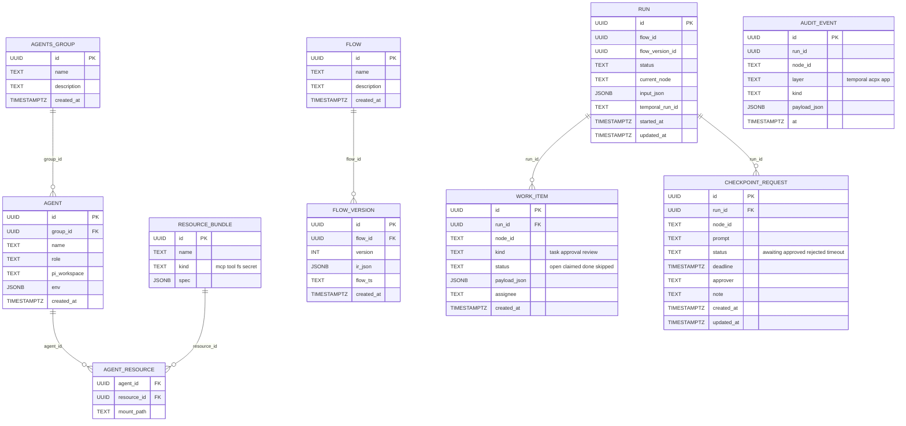

# Data model

Four Postgres schemas, one per bounded context. All migrations live under
`db/migrations/<schema>/` and are applied by goose. Each schema is owned by
exactly one service.

## Schema ownership

| Schema   | Owning service       | Migrations directory             |
|----------|----------------------|----------------------------------|
| `agents` | agents-service       | `db/migrations/agents/`          |
| `flows`  | flow-service         | `db/migrations/flows/`           |
| `runs`   | orchestrator-service | `db/migrations/runs/`            |
| `audit`  | gateway (writers from all services) | `db/migrations/audit/` |

Cross-schema foreign keys are forbidden. References (e.g.
`runs.run.flow_id`) are by id only, with no DB-level constraint. Joins live
in the gateway aggregator, not in SQL.

## ER diagram

## Notes

- `flows.flow_version.flow_ts` mirrors `flowir.Codegen`'s output. It is
  stored to make the desktop editor view round-trippable without re-running
  codegen.
- `runs.run.temporal_run_id` links a row to its Temporal workflow execution
  for layer-1 audit lookups.
- `runs.checkpoint_request.id` is created by the orchestrator as
  `"<run_id>:<node_id>"` (see `workflow.go`); the column stores that exact
  string when the checkpoint is materialised.
- `audit.audit_event` is intentionally denormalised; indexed by `(run_id,
  at)`. It survives indefinitely (no `MaxAge`).

## Cross-references

- [agents-service.md](./agents-service.md#owned-schema)
- [flow-service.md](./flow-service.md#owned-schema)
- [orchestrator-service.md](./orchestrator-service.md#owned-schema)
- [observability.md](./observability.md#the-three-audit-layers)
