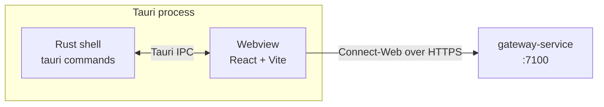

# Desktop app

Tauri v2 (Rust shell) + React + TypeScript + React Flow. Source under
`apps/desktop/`. The web layer is the primary UI; the Rust shell carries
the filesystem, secret store, and OS-integration calls.

## Architecture

Two transport choices, by design:

- **Connect-Web → gateway-service** for every business RPC. The desktop
  speaks gRPC-Web to the gateway's `:7100` HTTP port. This is the only
  channel that touches `agents.v1`, `flows.v1`, `execution.v1`, `audit.v1`.
- **Tauri IPC → Rust shell** for *only* OS-level concerns:
  - filesystem access (open / save IR JSON or `.flow.ts`),
  - secret store (read / write the bearer token used for gateway auth),
  - notifications and tray integration.

No business state lives in the Rust shell. The shell does not call the
gateway; the webview does.

## Why split this way

- Keeps the contract surface tiny: the gateway's gRPC contract is the
  authoritative source for everything UI-facing.
- The Rust shell can be code-reviewed for security in isolation — it is
  only OS-integration glue.
- A future browser-only build is trivial: drop the shell, keep the
  Connect-Web client untouched.

## Routing map

| Route        | Purpose                                                        | Primary RPCs                                       |
|--------------|----------------------------------------------------------------|----------------------------------------------------|
| `/groups`    | Browse and manage agent groups, drill into agents and resources. | `agents.v1.AgentsService.ListGroups/ListAgents/AttachResource` |
| `/flows`     | Flow list, version history, IR editor with codegen preview.    | `flows.v1.FlowService.ListFlows/GetFlow/PutVersion/Validate/Codegen/Generate` |
| `/runs`      | Active and historical runs, segment timeline, work-item inbox. | `execution.v1.ExecutionService.ListRuns/GetRun/StartRun/ApproveCheckpoint/RejectCheckpoint/StreamRunEvents` |
| `/audit`     | Per-run merged audit timeline across the three layers.         | `audit.v1.AuditService.ListAudit/TailAudit`        |
| `/settings`  | Gateway URL, auth token (stored in Tauri secret store), theme. | (local)                                            |

## React Flow canvas

The IR editor under `/flows/:id/edit` renders the Flow IR as a React Flow
graph. Mapping:

- One React Flow `node` per IR `node`. Node component is selected by
  `kind`: `acp`, `action`, `compute`, `decision`, `checkpoint`, `fork`,
  `join`, `end`.
- One React Flow `edge` per IR `edge`. Decision `branches[]` are rendered
  as labelled edges from the decision node — *not* as IR edges, because
  the IR model places them on the node, not the edge list.
- The canvas reads from `GetFlow` and writes through `PutVersion`; every
  save bumps `flow_version.version`.
- Validation runs client-side via the embedded JSON schema and server-side
  via `Validate` before each save. Both must pass before `PutVersion` is
  called.

Layout: a left dock for the node palette, the canvas in the centre, a
right dock for the selected node's property sheet. The codegen `.flow.ts`
preview lives in a slide-out drawer powered by `Codegen`.

## Live run view

`/runs/:id` opens an `ExecutionService.StreamRunEvents` stream and an
`AuditService.TailAudit` stream side by side. Run-event types map to UI
chips:

- `started`, `finished` → segment timeline cards.
- `log` → collapsible terminal-style stream.
- `checkpoint_awaiting` → blocking modal with the prompt and approver
  list; calls `ApproveCheckpoint` / `RejectCheckpoint`.
- `work_item` → adds to the work-item inbox.
- `error` → error toast + a row in the audit panel.

## Build and dev

- Web dev: `cd apps/desktop/web && npm install && npm run dev`. Vite serves
  the webview against the gateway at `http://localhost:7100`.
- Tauri dev: `cd apps/desktop && cargo tauri dev`. Bundles the webview and
  the Rust shell.
- The gateway address is read from `VITE_GATEWAY_URL` in the web build and
  from a Tauri config key in the bundled build.

## See also

- [gateway-service.md](./gateway-service.md) — the contract this app
  consumes.
- [flow-ir.md](./flow-ir.md) — the IR the canvas edits.
- [security.md](./security.md) — secret-store handling.
