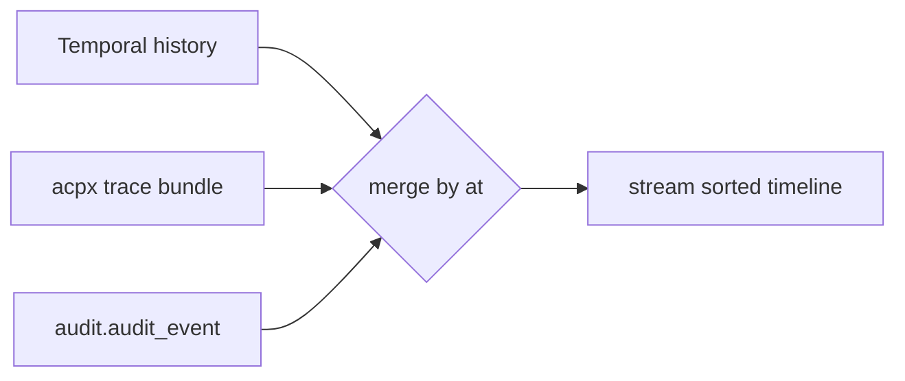

# gateway-service

Single externally-exposed endpoint for the desktop app and remote clients. No
schema of its own. Service manifest: `services/gateway/service.yaml`.

## Responsibilities

- Terminate gRPC and gRPC-Web on a single port pair (`:7000` gRPC, `:7100`
  HTTP).
- Proxy `agents.v1.AgentsService`, `flows.v1.FlowService`,
  `execution.v1.ExecutionService`, and `audit.v1.AuditService` to the owning
  upstream services.
- Aggregate the **audit timeline** for a run across the three durable
  audit layers.
- Subscribe to NATS subjects (`agents.*`, `flows.*`, `runs.*`, `audit.event`)
  so the desktop can render live state without holding open per-service
  streams.

The gateway is the only service the desktop talks to. It never touches
Postgres directly.

## Upstream proxying

Each gRPC call is forwarded with the caller's metadata (auth token,
trace context) intact. The gateway adds no business logic to proxied RPCs;
it is a thin router. Resolution map from `service.yaml` env:

| Service          | Env var                       | Default              |
|------------------|-------------------------------|----------------------|
| agents-service   | `GATEWAY_AGENTS_ADDR`         | `localhost:7001`     |
| flow-service     | `GATEWAY_FLOW_ADDR`           | `localhost:7002`     |
| orchestrator     | `GATEWAY_ORCHESTRATOR_ADDR`   | `localhost:7003`     |

## Aggregation patterns

### Audit timeline

A run's history is reconstructed from three sources, in time order:

1. **Temporal history** — the workflow `RunFlow`'s history events.
   Layer tag: `temporal`. Fetched via the Temporal SDK's `GetWorkflowHistory`,
   keyed by `runs.run.temporal_run_id`.
2. **acpx trace bundle** — per-segment trace files written by the runtime
   adapter into `WorkspaceDir`. Layer tag: `acpx`. Read via the
   orchestrator's `StreamRunEvents` RPC.
3. **`audit.audit_event` rows** — application-level events written by every
   service. Layer tag: `app`. Fetched via `audit.v1.AuditService.ListAudit`.

`AuditService.ListAudit` returns the merged sequence sorted by `at`, with
each event carrying its `layer` so the desktop can colour-code rows.



### Live tailing

`AuditService.TailAudit` and `ExecutionService.StreamRunEvents` are
implemented in the gateway by subscribing to the corresponding JetStream
subjects filtered by `run_id`. See [events.md](./events.md) for the full
subject list. The gateway holds one durable consumer per stream type and
fans out to N WebSocket clients.

## gRPC surface

The gateway exposes the union of the upstream services. It adds no new RPCs.
HTTP-on-:7100 serves the gRPC-Web transcoded variant used by the desktop via
Connect-Web.

## Events produced / consumed

- **Produced:** none.
- **Consumed:** `agents.*`, `flows.*`, `runs.*`, `audit.event` (see
  `service.yaml`).

## Config keys

Prefix `GATEWAY`.

```yaml
service: gateway
grpc_addr: ":7000"
http_addr: ":7100"
nats:
  url: "nats://localhost:4222"
  stream: AWPA
auth:
  mode: none      # or static-token; gateway is the auth boundary
```

Upstream addresses are required (`GATEWAY_AGENTS_ADDR`,
`GATEWAY_FLOW_ADDR`, `GATEWAY_ORCHESTRATOR_ADDR`).

## Failure modes

- **Upstream unreachable**: the proxied RPC returns the upstream's status
  (typically `Unavailable`); the gateway adds no retries.
- **NATS unreachable**: streaming RPCs return `Unavailable` immediately;
  point-RPCs still succeed because they go straight to upstream gRPC.
- **Mixed-layer audit out of order**: the merge is best-effort by `at`
  timestamp. Tie-breaks fall back to insertion order. This is acceptable
  because each layer's clock is monotonic in practice.

## Capacity notes

- Stateless. Scale horizontally.
- Connection pool to each upstream is 16; bump for production deployments.
- WebSocket fan-out from NATS is bounded by the JetStream consumer's
  `MaxAckPending`; default 1024.

## See also

- [observability.md](./observability.md) — three-layer audit details.
- [security.md](./security.md) — gateway is the auth termination point.
