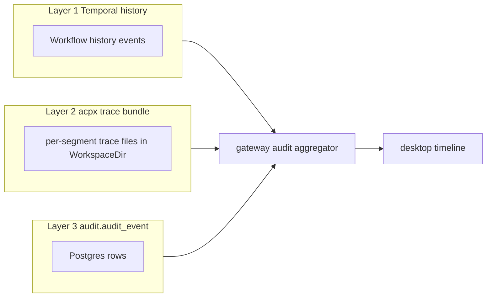

# Observability

Three pillars: logs, traces, and the three-layer audit log specific to this
platform. The shared library is `pkg/obs`.

## Logging

- Format: JSON (slog). `log_format: text` is available for local dev.
- Level: `log_level` in `config.Base`. Default `info`.
- Standard fields written on every record:

| Field      | Source                                    | Notes                                  |
|------------|-------------------------------------------|----------------------------------------|
| `service`  | `config.Base.Service`                     | e.g. `agents`, `flow`, `orchestrator`. |
| `env`      | `config.Base.Env`                         | `dev`, `staging`, `prod`.              |
| `run_id`   | request context (when present)            | Flow run id, propagated through gRPC metadata. |
| `trace_id` | OTel span context                         | Empty when OTel disabled.              |
| `span_id`  | OTel span context                         | Empty when OTel disabled.              |
| `caller`   | slog source                               | file:line of the log site.             |

Redaction: keys matching `(?i)(password|secret|token|authorization|dsn)`
have their values replaced with `***` before encoding. See
[security.md](./security.md#log-redaction).

## Tracing (planned)

OpenTelemetry is wired in `pkg/obs` but disabled by default
(`otel.enabled: false`). Conventions:

- Span names: `service.handler.method` (e.g.
  `orchestrator.ExecutionService.StartRun`).
- Workflow span: one root span per Temporal workflow run, named
  `orchestrator.workflow.RunFlow`, attribute `run.id`.
- Segment span: child of the workflow root,
  `orchestrator.activity.ExecuteSegment`, attributes `node.from`,
  `node.to`.
- Cross-service trace context is propagated via standard W3C trace headers
  on gRPC metadata; gateway forwards them unchanged.

## Metrics

A small set of Prometheus-style metrics is registered by `pkg/obs`. Names use
the `awpa_` prefix.

| Metric                                            | Type      | Labels                                  |
|---------------------------------------------------|-----------|-----------------------------------------|
| `awpa_grpc_requests_total`                        | counter   | `service`, `method`, `code`             |
| `awpa_grpc_request_duration_seconds`              | histogram | `service`, `method`                     |
| `awpa_run_total`                                  | counter   | `status`                                |
| `awpa_run_segment_duration_seconds`               | histogram | `node_from`, `node_to`                  |
| `awpa_checkpoint_wait_seconds`                    | histogram | `outcome` (approved/rejected/timeout)   |
| `awpa_nats_publish_total`                         | counter   | `subject`, `result`                     |

## The three audit layers

The platform deliberately keeps three sources of truth and reconciles them
at read time in the gateway:



### Layer 1: Temporal history

The orchestrator's `RunFlow` workflow writes a Temporal history per run.
Events include workflow scheduled/started/completed and every activity
attempt. Layer tag in the merged stream: `temporal`. Fetched via the
Temporal SDK keyed by `runs.run.temporal_run_id`.

### Layer 2: acpx trace bundles

Each `ExecuteSegment` activity drives the acpx runtime, which writes a
trace bundle (one JSON-lines file per segment) into `WorkspaceDir`. The
runtime adapter forwards each event into the orchestrator via the
`runtime.Event` channel; `activity.RecordHeartbeat` fires on every event.
Layer tag: `acpx`. Surfaced live through
`ExecutionService.StreamRunEvents`.

### Layer 3: `audit.audit_event`

Postgres table from `db/migrations/audit/001_init.sql`:

```sql
audit.audit_event (
  id, run_id, node_id, layer TEXT, -- 'temporal'|'acpx'|'app'
  kind, payload_json, at
)
```

Written by every service via the `pkg/events` publish-to-audit adapter.
Layer tag in the table mirrors the merged stream tag. Indexed by
`(run_id, at)`.

### Why three layers

- Temporal history is non-negotiable durable workflow state, but it cannot
  cheaply hold per-token agent reasoning.
- acpx trace bundles carry the high-volume agent-internal events and are
  rotated on disk.
- `audit.audit_event` is the curated, query-friendly record for compliance
  and the desktop timeline.

`audit.v1.AuditService.ListAudit` and `TailAudit` (gateway) return the
merged stream. See
[gateway-service.md](./gateway-service.md#audit-timeline).

## See also

- [config.md](./config.md) — `LogLevel`, `LogFormat`, `OTel`.
- [security.md](./security.md) — log redaction policy.
