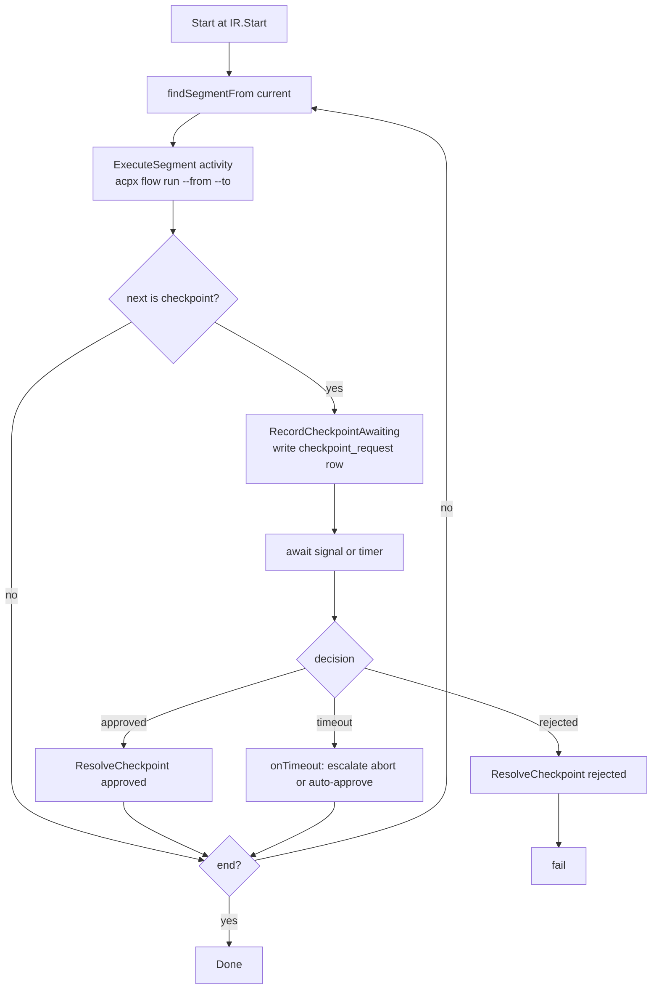

# orchestrator-service

Owns flow execution. Backing schema: `runs.*`. Service manifest:
`services/orchestrator/service.yaml`. gRPC contract:
`proto/execution/v1/execution.proto`. Workflow implementation:
`services/orchestrator/internal/workflow/workflow.go`.

## Responsibilities

- Persist run state, work items, and checkpoint requests.
- Drive a Temporal workflow per run (`RunFlow`) that walks the IR segment by
  segment between checkpoints.
- Expose checkpoint approve / reject as gRPC RPCs that translate into Temporal
  signals.
- Stream run events to consumers (desktop, gateway).

## Owned schema

From `db/migrations/runs/001_init.sql`:

| Table                       | Columns                                                                                                       |
|-----------------------------|---------------------------------------------------------------------------------------------------------------|
| `runs.run`                  | `id UUID PK`, `flow_id UUID`, `flow_version_id UUID`, `status TEXT`, `current_node TEXT`, `input_json JSONB`, `temporal_run_id TEXT`, `started_at`, `updated_at` |
| `runs.work_item`            | `id UUID PK`, `run_id UUID FK`, `node_id TEXT`, `kind TEXT`, `status TEXT`, `payload_json JSONB`, `assignee TEXT`, `created_at` |
| `runs.checkpoint_request`   | `id UUID PK`, `run_id UUID FK`, `node_id TEXT`, `prompt TEXT`, `status TEXT`, `deadline TIMESTAMPTZ`, `approver TEXT`, `note TEXT`, `created_at`, `updated_at` |

Indexes: `idx_run_flow`, `idx_work_item_run`, `idx_checkpoint_request_run`.
`status` values mirror `Run.status` from the proto: `pending | running |
awaiting_checkpoint | completed | failed | cancelled`.

## gRPC surface

`execution.v1.ExecutionService`:

| RPC                   | Request → Response                                          | Notes                                                                  |
|-----------------------|-------------------------------------------------------------|------------------------------------------------------------------------|
| `StartRun`            | `StartRunRequest` → `StartRunResponse`                      | Writes `runs.run` row, starts a Temporal workflow, returns the run.    |
| `GetRun`              | `GetRunRequest` → `GetRunResponse`                          | DB read.                                                               |
| `ListRuns`            | `ListRunsRequest` → `ListRunsResponse`                      | Filter by `flow_id`, cursor-paginated.                                 |
| `ApproveCheckpoint`   | `ApproveCheckpointRequest` → `ApproveCheckpointResponse`    | Sends `SignalCheckpointApproved` to the workflow.                      |
| `RejectCheckpoint`    | `RejectCheckpointRequest` → `RejectCheckpointResponse`      | Sends `SignalCheckpointRejected`.                                      |
| `StreamRunEvents`     | `StreamRunEventsRequest` → stream `RunEvent`                | Fan-out of NATS run subjects filtered by `run_id`.                     |

## Temporal workflow

`RunFlow` (see `workflow.go`) walks the IR:



Key constants:

- `SignalCheckpointApproved = "CheckpointApproved"`
- `SignalCheckpointRejected = "CheckpointRejected"`
- Activity names: `ExecuteSegmentActivityName = "ExecuteSegment"`,
  `RecordCheckpointAwaitingActivityName = "RecordCheckpointAwaiting"`,
  `ResolveCheckpointActivityName = "ResolveCheckpoint"`.

Activity options used by `RunFlow`:

- `ExecuteSegment`: `StartToCloseTimeout = 30m`, `HeartbeatTimeout = 1m`,
  `RetryPolicy.MaximumAttempts = 3`.
- `RecordCheckpointAwaiting` / `ResolveCheckpoint`: `StartToCloseTimeout = 1m`.

Checkpoint timeout default is 86400 seconds when `Node.TimeoutSeconds` is
zero. `Node.OnTimeout` is one of `escalate | abort | auto-approve`.

## AgentRuntime port

Activities call `pkg/runtime.AgentRuntime.RunSegment(ctx, SegmentRequest,
chan Event)`. The orchestrator binds the real implementation (which shells out
to `acpx flow run --from --to` with the generated `.flow.ts` path) at startup.
For tests and offline dev, `stubs.runtime: stub` swaps in a canned-segment
implementation. Heartbeats are emitted on every `Event` received from the
runtime channel — this gives Temporal sub-minute liveness on a 30-minute
segment.

## Events produced

All subjects from `pkg/events/subjects.go`:

- `runs.run.started` — `SubjectRunStarted`
- `runs.run.updated` — `SubjectRunUpdated`
- `runs.run.completed` — `SubjectRunCompleted`
- `runs.run.failed` — `SubjectRunFailed`
- `runs.checkpoint.awaiting` — `SubjectRunCheckpointWait`
- `runs.checkpoint.resolved` — `SubjectRunCheckpointDone`
- `runs.segment.started` — `SubjectRunSegmentStart`
- `runs.segment.finished` — `SubjectRunSegmentEnd`
- `runs.workitem.emitted` — `SubjectRunWorkItemEmitted`

Audit copies of these go to `audit.event` via the orchestrator's audit sink.

## Config keys

Prefix `ORCHESTRATOR`. Required envs: `ORCHESTRATOR_POSTGRES_DSN`,
`ORCHESTRATOR_TEMPORAL_HOST_PORT`.

```yaml
service: orchestrator
grpc_addr: ":7003"
http_addr: ":7103"
postgres: { dsn: "...", schema: runs }
nats:     { url: "nats://localhost:4222", stream: AWPA }
temporal:
  host_port: "localhost:7233"
  namespace: default
  task_queue: awpa-orchestrator
stubs:
  runtime: real   # set "stub" to use the canned segment runner
```

## Failure modes

- **Segment activity exhausts retries**: workflow returns a wrapped error,
  status `failed`, `runs.run.failed` published.
- **Checkpoint timeout with `onTimeout=escalate`**: workflow fails with
  "escalation required"; an operator must restart with a fresh decision.
- **Cycle without a checkpoint or end**: `nextSegment` returns
  "cycle in flow without checkpoint or end". Caught at IR validation in
  flow-service; this is a defense in depth.
- **Temporal unreachable at `StartRun`**: returns `Unavailable` and rolls back
  the `runs.run` row.

## Capacity notes

- One Temporal worker per orchestrator process. Concurrent workflows scale
  horizontally — task queue is `awpa-orchestrator`.
- The 30-minute segment timeout assumes the longest realistic acpx segment
  fits in that window; for long-running agents the heartbeat (1m) is the
  liveness signal.
- `StreamRunEvents` clients are deduplicated by `run_id`; one NATS
  subscription per stream call.

## See also

- [flow-ir.md](./flow-ir.md) — segmentation rules at the IR level.
- [observability.md](./observability.md) — audit-layer mapping.
