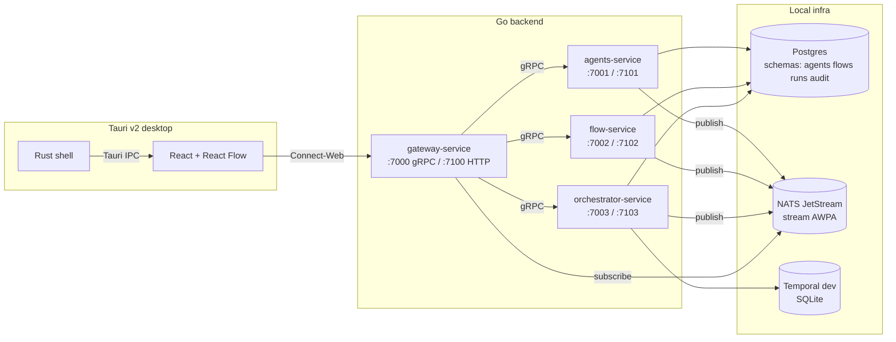

# Platform overview

`agentic-workflow-pi-acpx` is a Go monorepo of four siloed backend services plus
a Tauri v2 desktop shell. It orchestrates `acpx` flow runs over `pi` agents.
Coarse-grained durability is owned by Temporal; runs are segmented at IR
`checkpoint` nodes and each segment is one Temporal activity.

This document is the integration map. Every other spec in [docs/spec/](./)
narrows in on one bounded context.

## Service map

## Bounded contexts

| Context        | Service path                  | Owns Postgres schema | gRPC contract                         |
|----------------|-------------------------------|----------------------|----------------------------------------|
| Agents         | `services/agents/`            | `agents`             | `proto/agents/v1/agents.proto`         |
| Flows          | `services/flow/`              | `flows`              | `proto/flows/v1/flows.proto`           |
| Orchestrator   | `services/orchestrator/`      | `runs`               | `proto/execution/v1/execution.proto`   |
| Gateway        | `services/gateway/`           | (none)               | re-exports all three + audit           |
| Audit          | embedded in gateway/orchestrator | `audit`           | `proto/audit/v1/audit.proto`           |

The pi agent runtime and the flow-author skill live in `agents/` at the repo
root (not a Go service). The acpx engine is invoked by the orchestrator through
the `pkg/runtime.AgentRuntime` port.

## Integration rules

1. Services do not import each other's Go packages. The only allowed
   cross-service code paths are:
   - gRPC contracts declared in `proto/` and generated under
     `pkg/protogen/<package>/v<n>/`.
   - NATS subjects declared as constants in `pkg/events/subjects.go`.
2. Each schema in `db/migrations/<schema>/` has exactly one owner service —
   listed in that service's `service.yaml` under `schema:`.
3. Services may only write to their own schema. The gateway reads via gRPC,
   never the database.
4. Subject names use the form `<context>.<entity>.<verb>`; producers and
   consumers are enumerated in [events.md](./events.md).
5. Configuration is layered through `pkg/config` — defaults, repo
   `config.yaml`, user file `<PREFIX>_CONFIG`, env `<PREFIX>_<KEY>`. See
   [config.md](./config.md).

## Where to look next

- Service deep-dives: [agents-service.md](./agents-service.md),
  [flow-service.md](./flow-service.md),
  [orchestrator-service.md](./orchestrator-service.md),
  [gateway-service.md](./gateway-service.md).
- Canonical IR format: [flow-ir.md](./flow-ir.md).
- Cross-cutting: [config.md](./config.md), [security.md](./security.md),
  [observability.md](./observability.md), [events.md](./events.md),
  [data-model.md](./data-model.md).
- Desktop: [desktop-app.md](./desktop-app.md).
- Plan to GA: [roadmap.md](./roadmap.md).
